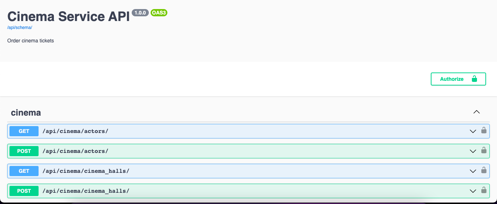
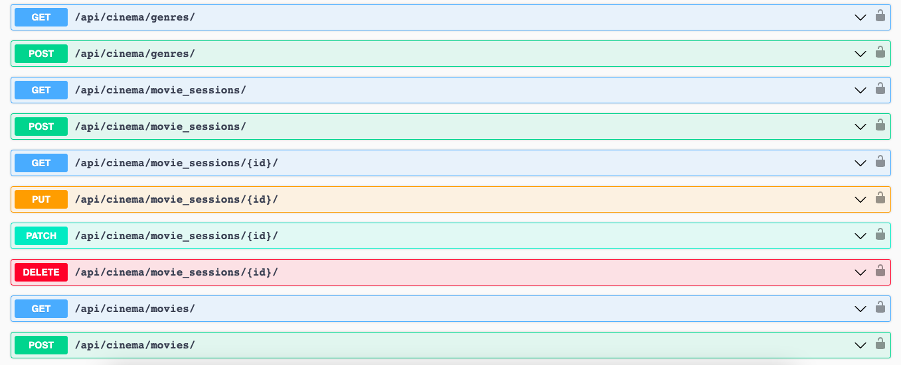
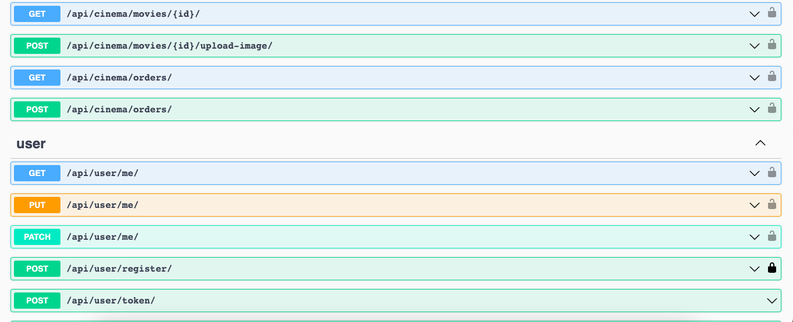
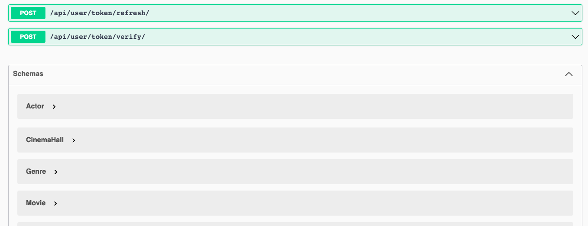
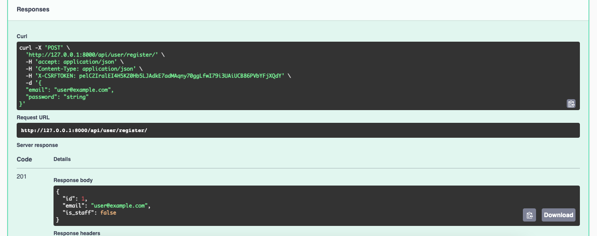

# Cinema Service

Django REST API for Cinema Service

## Getting access

* Create user on /api/user/register/
* Get access token on /api/user/token/

## Features

* Authentication with JWT Token
* Creating actors, genres, movies, cinema halls and movie session
* Managing tickets and orders
* API documentation implemented: http://127.0.0.1:8000/api/doc/swagger/
* Powerful admin panel for advanced managing

## Installation with GitHub

```shell
git clone https://github.com/anatomst/cinema-service.git
python3 -m venv venv
source venv/bin/activate (on Linux and macOS) or venv\Scripts\activate (on Windows)
pip install -r requirements.txt

"To run server"

"First method:"
export DB_HOST=<db_hostname>
export DB_NAME=<db_name>
export DB_USER=<db_username>
export DB_PASSWORD=<db_password>
python manage.py runserver

"Second method:"
"Add .env file in pycharm run configuration as EnvFile and run server"
```

## You can run it using Docker

```shell
docker-compose up
```

## Screenshots










